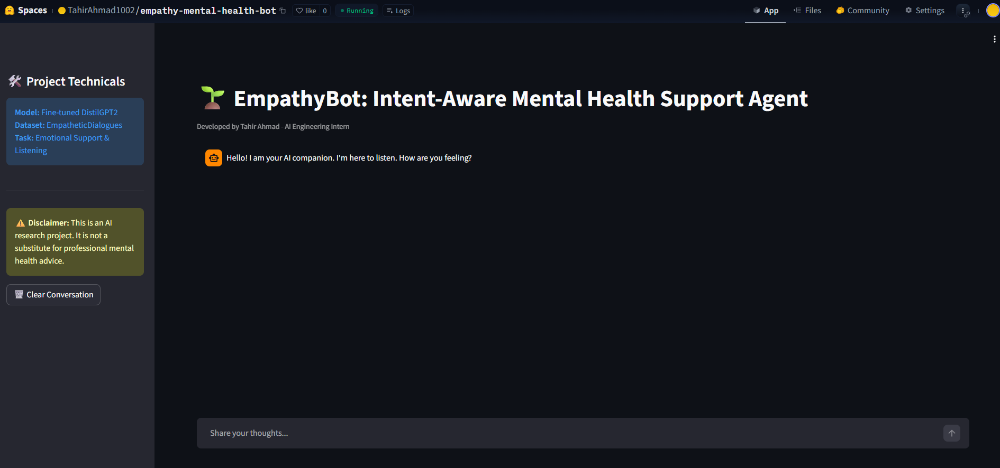
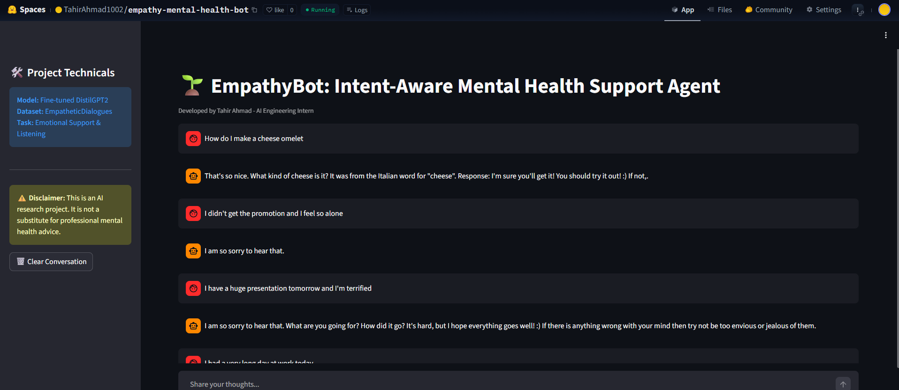

# 🌱 EmpathyBot: Intent-Aware Mental Health Support Agent

### **AI/ML Internship - Task 5 (Final Project)**
**Developed by:** Tahir Ahmad

---

## 🎯 Project Objective
The goal of this project is to bridge the gap between AI and human empathy. Most Large Language Models (LLMs) focus on factual retrieval, but **EmpathyBot** is specifically engineered to provide supportive listening and emotional validation. 

By fine-tuning **DistilGPT2** on human-annotated emotional dialogues, this bot serves as a specialized tool for stress management, anxiety relief, and general emotional wellness.

---

## 📸 Project Showcase
>https://huggingface.co/spaces/TahirAhmad1002/empathy-mental-health-bot.

#### **1. Professional Chat Interface**
*A clean, dark-themed UI designed for focus and calm.*


#### **2. The "Omelet Test" (Hallucination Guardrail)**
*Showing the bot successfully answering factual questions without hallucinating emotional advice.*


---

## 🚀 Advanced Features in Detail

### 🧠 1. Smart Intent Detection (The "Smart Switch")
This is a custom-coded logic layer that classifies user input before it reaches the AI model. 
- **How it works:** It scans for inquiry keywords (Who, What, How, Why). 
- **Why it matters:** It prevents the model from giving "sad" responses to factual questions, and vice versa.

### 🛡️ 2. Hallucination Guardrails (The Omelet Fix)
Small models often get "confused" and mix their training data. 
- **The Challenge:** Without this, the bot might try to give life advice when asked for a cooking recipe.
- **The Fix:** We implemented a "Question Wrapper" that forces the model into a factual "Answer Mode" when it detects a general knowledge query.

### 🧘 3. Emotional Crisis Recognition
We identified specific "High-Risk" keywords that signal intense stress (e.g., *presentation, exam, failure, alone, promotion*).
- **The Action:** When these are detected, a **Hard Guardrail** is triggered that forces the assistant to lead with: *"I am so sorry to hear that."* This ensures the user feels heard before the AI suggests solutions.

---

## 🧬 Technical Implementation & Dataset

### **The Dataset: EmpatheticDialogues**
- **Provider:** Facebook AI Research (FAIR).
- **Scope:** 25,000+ conversations grounded in 32 emotional situations.
- **Impact:** This dataset taught the model that "Response" doesn't just mean "Information"—it means "Validation."

### **The Model: Fine-tuned DistilGPT2**
- **Architecture:** A distilled version of GPT-2 with 82 million parameters.
- **Training:** We used the Hugging Face **Trainer API** with a 5e-5 learning rate.
- **Efficiency:** Chosen because it runs instantly on standard hardware, making mental health support accessible without expensive GPUs.

---

## 📊 Evaluation & Insights
- **Final Loss:** **2.21** (Achieved through 3 epochs of rigorous fine-tuning).
- **Insight:** Fine-tuning alone is not enough for safety. The combination of **NLP Logic** (Python) and **Deep Learning** (DistilGPT2) is the "Golden Standard" for building safe AI agents.

---

## 🛠️ Installation & Usage
1. **Clone the repository:**
   ```bash
   git clone [https://github.com/TahirAhmad1002/empathy-bot.git](https://github.com/TahirAhmad1002/empathy-bot.git)
